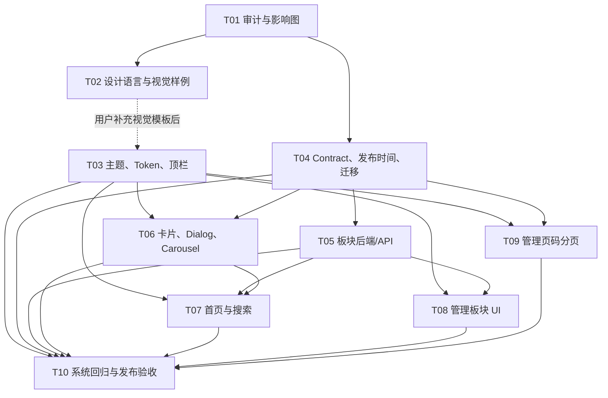

# T01 影响范围、文件所有权与依赖阻塞图

## 1. 使用说明

本文件把 V2 PRD 映射到现有模块、后续任务、测试和风险。它不是实施顺序之外的额外授权；每个子任务仍必须完成自己的 Brainstorm、规划审批和 `task.py start` 前置条件。

标记含义：

- `复用`：现有行为或模块可直接作为基础，但必须保留已有回归。
- `修改`：V2 目标明确要求变更当前行为。
- `新增`：当前不存在，需要新增文件、表、路由或测试。
- `消费`：任务读取另一个任务交付的 Contract/组件，不应并行改动 owner 文件。
- `阻塞`：未满足前不得进入对应实施或不得给出完成结论。

## 2. 冻结规则与全局依赖

### 2.1 产品硬约束

| 规则 | 公开端 | 管理端 | 责任 |
| --- | --- | --- | --- |
| `published` 可公开 | 列表、搜索、板块成员、详情深链均可 | 可查看/编辑 | T04/T05/T06/T07 |
| `delisted` 完全不公开 | 所有公开路径排除，不能只隐藏徽章 | 可查看、编辑、加入板块、重新发布 | T04/T05/T06/T07/T08 |
| 回收站/永久删除 | 不可公开 | 继续遵守既有 purge/R2/D1 状态机 | T05/T10 |
| 公开分页 | cursor + 无限滚动 | 不接受管理页码扩散 | T07/T09 |
| 管理分页 | 不适用 | 固定 50 条页码、total、URL、删除退页 | T09 |
| 视觉模板 | T01 不自拟 | T02 前不得冻结正式视觉 | 用户→T02→T03 |

### 2.2 依赖图

### 2.3 可并行与必须串行

| 阶段 | 可并行 | 必须等待/门禁 |
| --- | --- | --- |
| 审计后 | T02 规划输入准备、T04 迁移/Contract 设计可以分别推进 | T02 正式样例必须等待用户视觉模板；T04 实施前需吸收 T01 |
| 基础层 | T03 在 T02 确认后实施；T04 可先实施共享数据基础 | T05 必须等待 T04 schema/Contract；T03 必须等待 T02 |
| 公开端 | T06 可在 T03/T04 后实施组件；T07 可在 T05/T06 后整合首页 | 公开过滤和详情 Contract 必须先冻结；不得绕过 T04/T05 |
| 管理端 | T08 与 T09 可在 T03 后分工推进 | T08 需 T05；T09 需 T04；共享 AdminView/导航需串行合并 |
| 验收 | T10 可提前准备 fixture/矩阵 | T10 发布结论必须等待 T03–T09 全部交付并清零基线 |

## 3. 功能影响映射

| V2 功能 | 当前事实 | 影响文件/模块 | 主要 owner | 测试与验收 | 风险 |
| --- | --- | --- | --- | --- | --- |
| 三态主题 | config 仅 light/dark，main 无首屏初始化 | `shared/domain/config.ts`、`site.config.ts`、`src/style.css`、`src/app/main.ts`、顶栏/公共状态组件 | T03；T02 提供视觉输入 | config unit、主题 component、Playwright 首屏/系统偏好/存储异常 | 高：全站样式和首屏闪烁 |
| 顶栏 | 当前 App 只有 RouterView，V2 要 Logo、主题、GitHub、添加入口 | `src/App.vue`、`src/views/`、导航/按钮公共组件 | T03 | 桌面/移动/键盘/外链 URL 回归 | 中高：与 T07/T08 壳层冲突 |
| 群组卡片 | 当前展示 delisted badge，简介两行，存在硬编码颜色 | `src/features/groups/components/GroupCard.vue`、spec、共享 formatter | T06 | published-only fixture、四行简介、焦点/点赞/响应式 | 高：公开泄露规则和视觉 Token |
| 详情 Dialog | 当前详情能力分散在现有卡片/QR/复制流程，V2 要 `?group=` 深链 | groups detail route/composable、Dialog、share/copy、QR | T06；T07 接入首页 | URL merge、404/未发布、focus、scroll lock、分享 | 高：公开过滤和路由状态 |
| Carousel | 当前无 V2 发现/板块 Carousel 契约 | 新 Carousel/section components、首页容器 | T06 提供组件，T07 组装 | 拖动/滚轮/触摸/键盘、手机至少两卡 | 中高：模板和交互边界 |
| 发现新群 | 无 `last_published_at`，当前仅 rotation；用户确认初始数据全部 NULL | T04 migration/domain/repository；T07 首页 query | T04→T07 | 未来发布时间转换、NULL 排序、DESC+id、最多 10、固定时钟 | 高：新旧数据语义和排序共享 |
| 所有标签 | 当前 tags 在 group query 中，未提供聚合卡片 API | tag aggregation query/Contract、HomeView | T07；T04 提供共享字段边界 | 空/重复/计数/公开过滤/性能 | 中高：不要全量加载所有 group |
| 自定义板块 | 当前没有 boards/board_groups | 新 migration、repository/service/routes/Contract/UI | T04 schema；T05 backend；T08 admin；T07 public | CRUD、排序、enabled、zero/default/delete、成员安全 | 高：FK、回收站、公开投影 |
| 所有群组 Grid | 当前公开接口包含 delisted，并内存全量 rotation | groups route/repository、HomeView/GroupList | T04 公共状态；T07 公开查询/UI | 1000 fixture、cursor、无重复、published-only | C5：公开隔离与规模 |
| 搜索 | 当前 debounce/cursor/Abort，缺 IME/sequence 完整契约 | `useGroupDirectory.ts`、groups API/route、URL state | T07；T04 提供 Contract | q URL/history、IME、竞态、retry、empty/error | 中高：旧响应覆盖新结果 |
| 管理页码 | 当前 cursor/load more | admin route/Contract、`useAdminGroups.ts`、`AdminGroupTable.vue`、AdminView | T09；T08 提供壳层接口 | page=1/last/total/删除退页/URL/稳定排序 | 高：不能影响公开 cursor |
| 响应式管理表格 | 当前横向滚动全表，未按优先级隐藏列 | AdminGroupTable、drawer、AdminView | T09 | 桌面/中屏/窄屏、标题状态操作保留、ARIA | 中高：共享 table/drawer 冲突 |
| 资源上传/QR | 当前 asset lifecycle 基础存在，drawer 3 个测试失败 | asset Contract/service、AdminGroupDrawer/API、resource tests | T10 先稳定；T06/T08 消费 | staged/ready/replacement/close、R2/D1/refCount | 高：资源泄漏/误删 |
| 安全与错误 | CORS/Origin/request ID/error/SELECT * 存在 Spec 偏差 | app/middleware/repository/error tests | T10 统筹并转交实际 owner | every response request ID、Origin、CSRF、投影和错误 envelope | 高：安全与可观测性 |
| E2E/无障碍/发布 | 仅 Chromium 两 project、admin QR | Playwright config、fixtures、tests/e2e、未来 acceptance | T10 | Firefox/WebKit、主题、公开/管理、键盘/焦点、migration rehearsal | 发布阻塞 |

## 4. 文件所有权矩阵

### 4.1 任务级 owner

| 任务 | 唯一主要责任 | 允许修改的主要区域 | 明确不拥有 |
| --- | --- | --- | --- |
| T01 | 审计报告、影响图、规划建议 | `.trellis/tasks/08-01-01-lgqh-v2-spec-audit/` | 所有业务代码、测试、migration |
| T02 | 视觉语言、Token 候选、无后端样例 | T02 规划/原型目录、`ui-design.md`（用户确认后） | 生产 CSS、业务 API、真实 AdminGroupDrawer |
| T03 | 正式 theme、Token、顶栏、公共状态 | `shared/domain/config.ts` 的 theme 部分、`src/style.css`、`src/app/main.ts`、App/header/public status | 卡片/首页/板块/管理分页业务 |
| T04 | 发布状态/时间、显示宽度、boards schema、共享 Contract、迁移 | 新 forward migration、`shared/domain/`、`shared/contracts/` 的基础部分、状态转换入口 | 板块 CRUD/API、首页 UI、R2 清理编排 |
| T05 | 板块 repository/service/API、公开成员投影、关联清理接入 | 新 board backend 文件、board Workers tests、相关 purge integration | 主题、卡片、管理板块 UI、管理分页 |
| T06 | GroupCard、Dialog、Carousel、分享/焦点交互 | `src/features/groups/components/`、detail route/composable、相关 component tests | 首页区域编排、板块 backend、管理表格 |
| T07 | 首页信息架构、搜索和公开 query orchestration | `HomeView.vue`、groups composables/API、公开 section components、URL state | migration、board CRUD、管理页码 |
| T08 | 管理板块导航、容器、成员操作和拖拽 | admin board views/components、admin board tests | 群组 Contract、公共页面、管理 groups pagination |
| T09 | 管理群组页码、URL、表格列优先级和窄屏抽屉接入 | admin groups route/query/composable/table、pagination tests | 公开 cursor、board backend、全局 theme |
| T10 | 系统回归、基线清零、E2E/无障碍/发布验收 | Playwright config/fixtures/tests、acceptance、既有基线修复协调 | 私自改变产品规则；未批准的大规模业务重构 |

### 4.2 高冲突文件与合并顺序

| 文件/区域 | 当前冲突来源 | 主 owner/顺序 | 其他任务接入方式 |
| --- | --- | --- | --- |
| `shared/domain/config.ts` | platforms 基线、theme 三态、站点配置 | T04 先处理 platforms/共享 Contract；T03 在 T02 后接 theme | T03 只消费已冻结 schema；T10 验证 |
| `shared/contracts/group.ts` / `index.ts` | status、publish time、board member、public/admin DTO | T04 先冻结基础字段；T05 冻结 board DTO；T06/T07 消费 | 后续不得各自声明重复 interface |
| `functions/_lib/repositories/group-repository.ts` | 公开过滤、发布时间、board/public/admin 查询 | T04 先整理状态/时间边界；随后 T05/T07/T09 依序接入 | 每次只改一个查询 slice，先提交 Contract，再改调用方 |
| `functions/_lib/routes/groups.ts` | public cursor、search、published-only、详情 | T07 负责公开编排，使用 T04/T05 提供的 repository 契约 | T06 通过详情 controller 接入，不复制过滤 |
| `src/views/HomeView.vue` | T03 header、T06 components、T07 sections | T07 最终组装；T03/T06 提供 props/slots 契约 | 不在 T03/T06 中提前改首页布局 |
| `src/views/admin/AdminView.vue` | T08 board navigation、T09 groups pagination | T08 先定义 shell/navigation；T09 修改 groups panel接口 | 通过 typed props/events，不并行改同一区块 |
| `AdminGroupDrawer.vue` | T08/T09 管理壳层、T10 资源基线 | T10 先稳定资源所有权；后续任务只接入明确事件 | 不重复实现 purge 或改变 ready 资源语义 |
| `src/style.css` / public status styles | T02 候选、T03 正式 Token、T06/T07 使用 | T03 唯一正式 owner | T06/T07 使用 token，不提交硬编码颜色 |
| `playwright.config.ts` / fixtures | T06/T07/T08/T09 场景、T10 矩阵 | T10 唯一测试基础设施 owner | 各任务提供场景和 fixture 要求，不各自改 project |

### 4.3 不应修改的文件/边界

- T01 不得修改 `src/`、`shared/`、`functions/`、`migrations/`、`tests/`、`playwright.config.ts`、Tailwind 或依赖。
- 历史 `migrations/0001_initial.sql`、`0002_admin_group_management.sql`、`0003_group_mutation_token.sql` 不得编辑；T04 只能新增 forward migration。
- `docs/PRD/v2/RPD.md` 不由 T01 直接覆盖；总 PRD 修订建议先经父任务审批。
- T02 样例不得接入真实 API、D1、R2、认证、CSRF、生产导航或真实 AdminGroupDrawer 生命周期。
- T09 不得把管理 page number 改造传播到公开 cursor；T07 不得把公开搜索改成管理查询。
- T05/T08 的 board 删除/回收不得删除 group 或 asset；资源清理仍由既有 lifecycle owner 负责。

## 5. 质量基线责任图

| 基线 | 现状证据 | 修复 owner | 依赖/门禁 | 完成证据 |
| --- | --- | --- | --- | --- |
| `config.spec.ts` 旧 platforms 对象 | `shared/domain/config.ts` 为 string[]，spec 使用 `{id,name}` | T04 | 共享 Contract 先于 T03/T05/T07 | config unit、typecheck、相关调用方 |
| Drawer staged purge 3 failures | `AdminGroupDrawer.vue` 通过 `stagedAssetIds` 调用 `purgeStagedAsset`，spec 观察不到预期 fetch | T10 | 在任何资源/管理正式回归前 | 组件测试、资源 Workers、QR E2E |
| Image processor 文案 1 failure | spec 写 10MB，实际错误显示传入/默认限制 | T10 | 与 asset limits Contract 对齐 | composable tests + upload boundary |
| seed 数据宽度 | `scripts/seed-local.mjs` 生成内容必须满足标题 50/简介 1000；既有 lint 错误另行处理 | T04 | Contract 与测试 fixture 先于迁移/回归 | seed 生成数据通过宽度校验 |
| seed lint 1 failure | `scripts/seed-local.mjs` 的 `sortOrder++` 无后续使用 | T10 | 全量 lint 门禁 | `pnpm lint` |
| format 22 failures | `pnpm format:check` 当前失败 | T10 协调各文件 owner | 不得扩展为无关重构 | `pnpm format:check` + diff 范围 |

## 6. 依赖阻塞清单

| 阻塞项 | 阻塞任务 | 状态 | 解除条件 |
| --- | --- | --- | --- |
| 用户视觉模板未提供 | T02 正式样例、T03、T06/T07/T08/T09 的正式视觉实施 | 已确认延期，不阻塞 T01 审计 | 进入 T02 时用户提供模板并更新 `ui-design.md`/Spec |
| `last_published_at`、boards、relations 尚不存在 | T05、T07、T08、T10 | 阻塞实施 | T04 migration/Contract/“现有全部 NULL”验证/部署顺序通过评审和测试 |
| 公开仍返回 delisted | T06、T07、T10；板块公开查询受 T05 影响 | C5 风险门禁 | 所有公开入口只返回 published，Workers+E2E 负向测试通过 |
| 管理页码尚未定义 | T09、T10 | 阻塞管理 V2 验收 | page Contract、固定 50、total、URL、删除退页和稳定排序通过 |
| 当前质量基线未全绿 | T04、T10、最终发布 | 已确认责任 | T04/T10 提供根因、最小修复、测试和命令结果 |
| T02/T03 视觉正式边界未冻结 | T06/T07/T08/T09 | 阻塞正式视觉实施，不阻塞后端规划 | T02 样例确认，T03 Token/公共状态契约完成 |

## 7. 风险热力图

| 风险 | 概率 | 影响 | 等级 | 监控/缓解 |
| --- | --- | --- | --- | --- |
| delisted 从公开列表/搜索/详情/板块泄露 | 高 | 高 | C5 | 统一 published-only repository/API，Workers+Playwright 负向测试 |
| migration 初始化或 FK 破坏现有数据/R2 清理 | 中 | 高 | 高 | forward-only、现有全部 NULL 断言、当前 schema 升级演练、batch/rollback substitute、T10 验收 |
| 公开 cursor 与 rotation 全量内存逻辑规模回退 | 高 | 中高 | 高 | 1000 fixture、查询计划/limit、固定时钟和重复防护 |
| 管理 page number 与公开 cursor 串线 | 中 | 高 | 高 | Contract 分离、T09 owner、T10 跨分页回归 |
| 多任务同时改共享 repository/Contract | 高 | 高 | 高 | 先 T04 冻结、按顺序合并、接口消费而非复制 |
| 视觉模板缺失导致前端重复返工 | 高 | 中 | 中高 | T02 阻塞正式样例，T01 不自拟，T03 等确认 |
| staged asset purge 误删/泄漏 | 中 | 高 | 高 | T10 根因修复、D1/R2/refCount 断言和重复关闭测试 |
| 全量质量基线无法归因 V2 | 高 | 中 | 中高 | T04/T10 清零现有失败并记录提交/命令 |
| CORS/Origin/request ID/错误偏差被带入 V2 | 中 | 高 | 高 | T10 backend quality gate，逐项记录是否修复/延期 |
| E2E 仅 Chromium 造成移动/WebKit 回归漏检 | 高 | 中高 | 高 | T10 扩展 project、固定 fixture、键盘/焦点/主题矩阵 |

## 8. 建议实施顺序与验收闸门

1. T01 交付并冻结本报告与 `research.md`；不改业务代码。
2. T02 在视觉模板到位后完成 `ui-design.md`/原型，并获得视觉确认。
3. T04 先完成共享 Contract、状态/发布时间设计、migration、现有全部 NULL 验证和基础测试；同时处理已确认的 config baseline。
4. T03 在 T02/T04 相关契约满足后实现三态主题、Token、顶栏和公共状态；不得提前实现卡片/首页业务。
5. T05 实现板块后端、公开成员投影、管理 CRUD 和回收/永久删除关系清理；只允许 published 进入公开投影，delisted 可作为管理员成员。
6. T06 实现卡片、详情、Carousel、分享和焦点；T07 实现首页区域、标签聚合、搜索和公开 cursor；两者不得重新定义公开过滤。
7. T08 实现管理板块页面；T09 实现管理群组页码、窄屏列优先级和 URL。两者共享 AdminView 时按 owner 顺序合并。
8. T10 运行全量 lint/format/typecheck/unit/Workers/build/E2E/无障碍/迁移演练，确认下架隔离、资源生命周期和所有既有功能回归。

每个门禁都必须保留：命令、退出码、失败测试、根因、责任任务、修复提交和复测结果。未通过 C5-01、迁移安全、资源生命周期或认证/CSRF 的任务不得标记完成。

## 9. T01 交付状态

- [x] 已建立事实审计、Spec/代码/测试矩阵。
- [x] 已记录 V2 冲突、已确认决策和 C5 风险门禁。
- [x] 已建立可复用/必须修改模块清单。
- [x] 已建立任务级和高冲突文件所有权。
- [x] 已建立依赖阻塞清单和风险热力图。
- [x] 已记录质量基线责任：T04/T10。
- [x] 未修改业务代码、migration、测试代码或快照。
- [x] 已向用户提交最终 T01 规划摘要并获得明确批准；T04 或其他子任务仍未启动实施。
