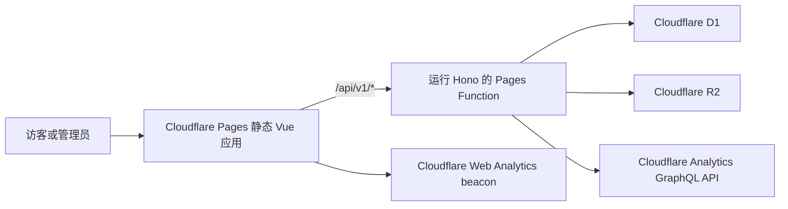

# 技术设计：来个群号

## 目的

本文档定义已确认 bootstrap PRD 的首版实现架构。仓库目前还没有产品源码，因此以下路径和契约是首次构建时必须遵循的目标边界。

## 系统形态



- Cloudflare Pages 提供编译后的 Vue 应用和静态平台 SVG 资源。
- 只有 `/api/*` 调用 Pages Functions；必须通过 Pages 路由配置排除静态路由。
- 一个 Hono 应用统一负责 `/api/v1/*`、通用中间件、校验、认证、错误映射和请求 ID。
- D1 保存关系型应用数据，R2 保存最终 WebP 对象。
- 仅管理员可用的 Analytics 端点使用保存在 Secret 中的最小权限 token 读取 Cloudflare Analytics。

## 技术基线

- Vue 3、Vite、严格模式 TypeScript、Composition API、`<script setup>`
- Vue Router
- Tailwind CSS 与 CSS 自定义属性
- 运行在 Cloudflare Pages Functions 上的 Hono
- 共享请求/响应 schema 的 Zod
- 直接使用 D1 预处理语句和带版本的 SQL migration
- 使用 R2 binding 保存 Logo 和二维码资源
- Cloudflare Turnstile 保护公开提交
- Vitest、Vue Test Utils、Cloudflare Workers Vitest integration、Playwright
- pnpm、ESLint、Prettier、`vue-tsc`

MVP 明确不引入 Pinia、ORM、完整 UI 组件库、独立搜索服务和传统后端服务器。

## 仓库边界

```text
src/                 Vue 应用
shared/              运行时 schema、DTO、领域联合类型、安全的共享 helper
functions/api/       Pages Function 入口
functions/_lib/      API 专用中间件、service、repository、adapter
migrations/          有序 D1 SQL migration
public/              可安全打包为公开内容的静态资源
tests/e2e/           Playwright 用户流程
site.config.ts       有类型约束且不含敏感信息的机构配置
wrangler.jsonc       本地/预览 binding 声明
```

前端模块和 Function 模块均可导入 `shared/`。`shared/` 不得导入 Vue、Hono、Cloudflare binding、DOM API 或仅限 Node 的 API。前端代码不得从 `functions/` 导入内容。

## 前端架构

- 路由视图负责协调功能，但不得直接发出原始请求或包含与数据库行结构一致的数据转换。
- 功能组件接收有类型约束的 props，并发出用户意图事件。
- Composable 负责请求生命周期、浏览器持久化、点赞乐观状态、取消和重试行为。
- 所有响应都由一个 API 客户端通过共享 Zod schema 解析。
- 首页搜索词由 URL query 状态负责；临时弹窗和表单状态保留在局部。
- 浏览器只持久化主题偏好、匿名设备 ID 和已点赞群聊 ID。
- CSS 变量负责机构主题 token，Tailwind 使用这些 token；不得把配置值复制到组件 class 中。

## API 与数据边界

- API 前缀为 `/api/v1`。
- 公开 serializer 只返回已发布或已下架的群聊，绝不返回提交者联系方式、审核备注、删除状态或内部对象 key。
- 管理员路由要求有效的签名限时 `HttpOnly` Cookie；不安全方法还必须通过 Origin/CSRF 保护。
- 所有不可信请求数据以及前端消费的响应数据都必须通过 Zod 校验。
- D1 repository 只接收归一化后的领域输入，并使用参数化预处理语句。

D1 核心实体：

- `groups`：标识、公开内容、性质、平台、业务状态、Logo 资源、轮换位置、缓存点赞数、版本、时间戳、软删除状态和永久删除进度。
- `group_tags`：已归一化并按展示顺序保存的标签。
- `join_methods`：`group_number`、`url` 或 `qr_code` 的值与顺序。
- `submission_details`：仅管理员可见的访客提交联系方式和审核备注。
- `assets`：R2 key 和已验证的 WebP 元数据。
- `likes`：唯一的 `(group_id, voter_hash)` 记录。
- `rate_limits`：Pages 项目不能使用原生 Cloudflare 限流 binding 时采用的有界服务端计数器。

Cloudflare Web Analytics 数据绝不复制到 D1。

## 关键流程

### 公开列表与搜索

1. 客户端携带可选的归一化 `q` 请求一个游标页。
2. API 根据 `site.config.ts` 计算当前 `Asia/Shanghai` 轮换时间窗。
3. D1 只按确定性循环顺序返回未删除的 `published` 和 `delisted` 群聊。
4. 公开 serializer 移除私有字段，返回游标和轮换时间窗标识符。
5. 客户端保持响应中的相对顺序进行渲染，并使用明确尺寸懒加载 Logo 资源。

### 访客提交

1. 浏览器校验文本字段并获取 Turnstile token。
2. API 再次校验 token、限流、平台、性质、URL 协议、标签数量、长度和控制字符。
3. D1 以原子方式写入一个 `pending` 群聊、文本加群方式、标签和私有提交详情。
4. 响应只包含受理回执 ID，不返回存储的私有记录。

### 点赞切换

1. 浏览器在本地保存匿名设备 ID 和已点赞群聊 ID。
2. 客户端发送幂等的点赞或取消点赞命令。
3. API 使用服务端 pepper 对设备 ID 做 hash，执行限流，并插入或删除唯一点赞记录。
4. 点赞记录和缓存计数以原子方式更新；返回的计数是权威值。
5. 请求失败时，乐观 UI 回滚。

### 管理员认证

1. 登录路由使用配置的 Secret 值或派生 hash 校验密码，并执行失败限流。
2. 成功后设置签名、限时且带 `HttpOnly`、`Secure`、`SameSite` 属性的 Cookie。
3. 中间件在每个管理员 API 请求中校验签名和有效期。
4. 退出登录使 Cookie 失效；密码和 token 均不得进入应用日志。

### 管理员图片上传

1. 浏览器接收 WebP、PNG 或 JPG/JPEG，并在本地解码。
2. JPG 转换为有损 WebP；PNG 转换为保留 alpha 通道的有损 WebP；WebP 可以直接使用或重新压缩。
3. 上传前向管理员展示尺寸、字节数和预览。
4. 客户端阻止超过 100 KB 的 Logo 和超过 300 KB 的二维码。
5. API 在写入带系统生成 key 的 R2 对象和 D1 元数据之前，独立验证 WebP 签名、元数据、用途和字节上限。

### 删除与永久清理

- 软删除写入删除元数据，并保留此前的业务状态。
- 恢复会清除删除元数据，并恢复该业务状态。
- 永久清理是可重试的多资源操作。它删除 D1 关联数据和没有其他引用的 R2 对象；只要任一侧尚未完成清理，就绝不报告完全成功。

## 错误与部分失败模型

- 所有 API 结果使用同一成功/错误信封，并包含 `requestId`。
- 已知的领域、校验、认证、冲突、限流和依赖失败映射为稳定的公开错误码。
- 响应绝不包含原始异常、SQL、堆栈、Secret、token、联系方式或对象内部信息。
- 仪表盘组件独立失败，Analytics 不可用时仍必须展示有效的 D1 业务数据。
- 多资源写入使用显式操作状态以及补偿或重试；绝不把 D1 和 R2 当成同一原子事务。

## 部署与环境隔离

- `main` 通过与 GitHub 连接的 Cloudflare Pages 部署生产环境。
- 预览部署使用独立的预览 D1 和 R2 binding。
- 本地开发使用本地 Wrangler 状态，默认绝不选择远程生产 binding。
- 公开机构配置提交在 `site.config.ts` 中。
- 管理员凭据、会话密钥、点赞 pepper、Turnstile secret 和 Analytics token 使用 Cloudflare Secrets。
- R2 生产资源通过自定义资源域名和不可变、内容寻址的 key 提供。

## 权衡

- 直接使用 SQL 可以保持 Function bundle 较小，但需要严格的行映射和 migration 测试。
- 不使用 Pinia 可以避免重复的全局状态，但要求 composable 具有清晰的职责归属。
- 浏览器端图片转换避免了边缘端图片处理依赖，但服务端仍必须把输出视为不可信输入。
- 共享管理员密码实现简单，但无法把变更归因到具体个人。
- 匿名点赞可以提高随意刷票的成本，但不能保证一人一票。

## 回滚方式

- Pages 部署通过 Cloudflare 部署历史回滚。
- D1 migration 只向前执行；每个破坏性 migration 都必须有备份/导出计划和明确的补偿 migration。
- 前端/API 联合发布期间，新增 API 字段必须保持向后兼容。
- R2 key 不可变；替换图片时先创建新 key，更新 D1，数据库变更成功后再清理旧对象。
